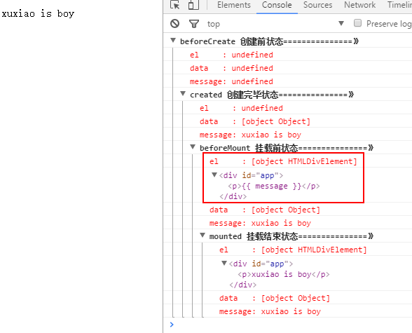

<h2 align="center">VUE笔记</h2>

## 生命周期




## 方法修饰符

1.

## vue 插槽

**普通插槽：**

```
<!-- 引用组件 -->
<navigation-link url="/profile">
  Your Profile
</navigation-link>

<!-- 组件 -->
<a
  v-bind:href="url"
  class="nav-link"
>
  <slot></slot>
</a>
```

**具名插槽：**

```
<!-- 子组件 -->
<div class="container">
  <header>
    <slot name="header"></slot>
  </header>
  <main>
    <slot></slot>
  </main>
  <footer>
    <slot name="footer"></slot>
  </footer>
</div>

<!-- 父组件 -->
<base-layout>
  <template slot="header">
    <h1>Here might be a page title</h1>
  </template>

  <p>A paragraph for the main content.</p>
  <p>And another one.</p>

  <template slot="footer">
    <p>Here's some contact info</p>
  </template>
</base-layout>
```

**作用域插槽：**

```
<!-- 子组件 -->
<slot v-bind="scope" />

<!-- 父组件 -->
<template slot-scope="{ row }">
  {{ row.name }}
</template>

<!-- 父组件拿到子组件的数据 -->
```

## v-for 中 key 的作用，是否必须

> 当 Vue.js 用 v-for 正在更新已渲染过的元素列表时，它默认用“就地复用”策略。如果数据项的顺序被改变，Vue 将不会移动 DOM 元素来匹配数据项的顺序， 而是简单复用此处每个元素，并且确保它在特定索引下显示已被渲染过的每个元素。这个类似 Vue 1.x 的 track-by="\$index" 。

<h2 align="center">VUEX</h2>

## mapState，mapMutations

> 当一个组件需要获取多个状态时候，将这些状态都声明为计算属性会有些重复和冗余。为了解决这个问题，我们可以使用 mapState 辅助函数帮助我们生成计算属性，让你少按几次键

```
computed: {
  ...mapState("common", ["asideTop", "asideFold", "controlOpen"])
},
methods: {
  ...mapMutations("common", ["updateAsideFold", "updateControlOpen"])
}
```

## v-cloak 的作用和用法

> HTML 绑定 Vue 实例，在页面加载时会闪烁,v-cloak 可以解决这一问题，在 css 中加上

```
[v-cloak] {
  display: none;
}
```

> 在 html 中的加载点加上 v-cloak，就可以解决这一问题

```
<div id="app" v-cloak>
    {{msg}}
</div>
```

## vue.config.js 配置

1.

## .env vue-cli3.0 环境变量与模式


