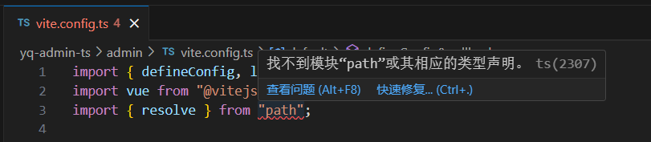
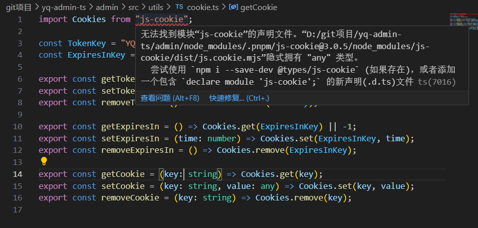
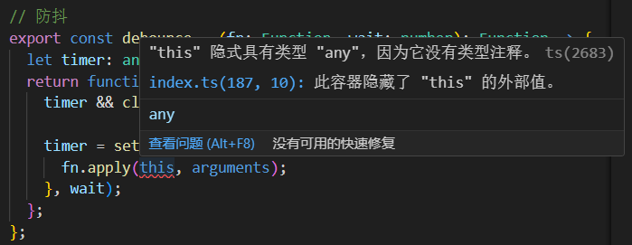
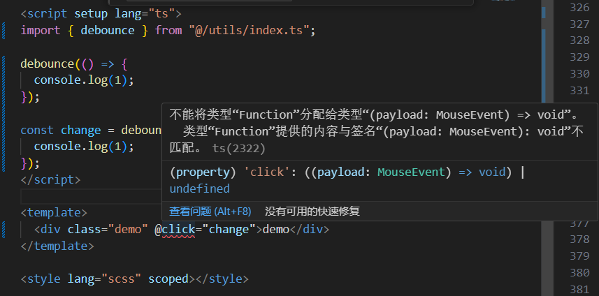

# 项目思维

一 框架思维

一个好的框架是便于开发、便于维护、便于理解、结构清晰、代码风格统一的。要搭建一个好的框架需要根据页面的结构，前端交互，后端数据获取和处理，接口报错处理来尽量提取共用逻辑，以最优的代码量完成业务，尽量减少重复代码和 copy 代码的出现，同一的 UI，一次构建，多地使用。函数方法，尽量将参数情况考虑全面。

1. 为什么要使用 TS

可以进行引入文件/依赖检测是否存在，检测变量类型，变量提示

二 项目错误处理

1. vite.config.ts

问题：import { resolve } from "path"; 报错，找不到模块“path”或其相应的类型声明。

原因分析：path 模块是 node.js 内置的功能，但 node.js 并不支持 TS，所以在 TS 项目里使用是不行的。

解决方案：安装 @types/node

2. js-cookie;

问题：import Cookies from "js-cookie"; 报错，无法找到模块“js-cookie”的声明文件。

解决方案：1. 在 main.ts 同级目录下生成 xxx.d.ts，内容 declare module "js-cookie" 手动声明;2. 安装 @types/js-cookie

3. this 指向

问题："this" 隐式具有类型 "any"，因为它没有类型注释。

解决方案：在 tsconfig.json 中，配置 "noImplicitThis": false。

4. @click 报错

问题：不能将类型“Function”分配给类型“(payload: MouseEvent) => void”

解决方案：@click="change()" 方法加()

