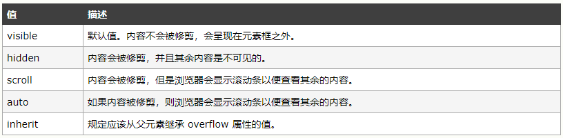
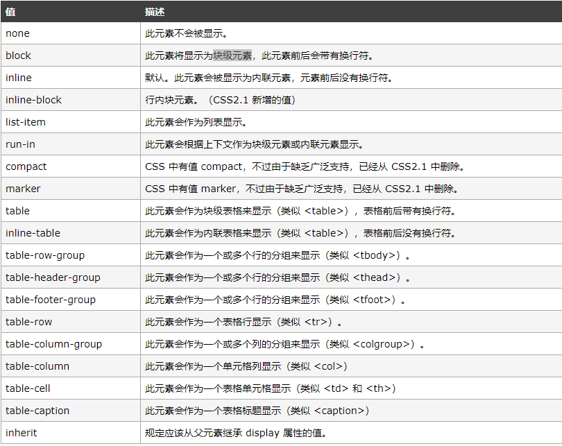

<h2 align="center">CSS学习笔记</h2>

## overflow

## display

## svg

### 1. fill、fill-opacity、fill-rule

> fill: 给绘制的图形填充颜色或图案，默认是 black

> fill-opacity: 指定绘制图形填充的透明度，其值是 0.0~1.0，其中 0.0 表示完全透明，1.0 表示完全不透明.

> fill-rule: 用来决定判断某个点是否在图形内部的方法，只有当边线交叉时或者内部有“洞”时和有效。属性值有 nonzero 和 evenodd，其默认值是 nonzero
