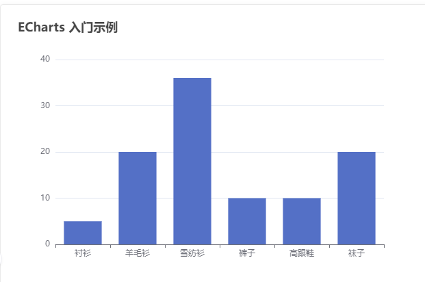

# echarts 快速入门

前言：本文档主要讲解 echarts 在 vue3 中的用法，及其 echarts 的一些配置参数含义及用法。示例参考 [echarts 示例](https://echarts.apache.org/examples/zh/index.html)

一：快速开始

1. 安装 echarts

```bash
npm install echarts
# or
pnpm add echarts
# or
yarn add echarts
```

2. 使用 echarts

```vue
<script setup lang="ts">
import { onMounted } from "vue";
import * as echarts from "echarts";

const initEchart = () => {
  // 基于准备好的dom，初始化echarts实例
  const myChart = echarts.init(document.getElementById("demo"));
  // 绘制图表
  myChart.setOption({
    title: {
      text: "ECharts 入门示例",
    },
    tooltip: {},
    xAxis: {
      data: ["衬衫", "羊毛衫", "雪纺衫", "裤子", "高跟鞋", "袜子"],
    },
    yAxis: {},
    series: [
      {
        name: "销量",
        type: "bar",
        data: [5, 20, 36, 10, 10, 20],
      },
    ],
  });
};
onMounted(() => {
  initEchart();
});
</script>

<template>
  <div id="demo" style="width: 600px; height: 400px">demoEchats</div>
</template>
```



二：基础概念

1. 图表容器及大小

1.1 设置 dom 节点宽高

推荐通过 css 设置该节点的宽高，该节点的大小默认就是图表的大小，调用 echarts.init 时必须保证容器已经有宽高了。

```html
<div id="demo" style="width: 600px; height: 400px"></div>
```

1.2 指定图表大小

如果容器未设置宽高，或你希望图表大小不等于容器大小，可以在初始化图表时设置大小。

```js
// 基于准备好的dom，初始化echarts实例
const myChart = echarts.init(document.getElementById("demo"), null, {
  width: 600,
  height: 400,
});
```

1.3 响应容器大小

有时候我们希望图表可以随容器大小的变化而变化，可以通过监听页面的 resize 事件获取浏览器大小改变的事件，然后调用 echartsInstance.resize 改变图表的大小。

```vue
<script setup lang="ts">
import { onMounted, ref } from "vue";
import * as echarts from "echarts";

let myChart = null;
const initEchart = () => {
  // 绘制图表
  myChart.setOption({
    title: {
      text: "ECharts 入门示例",
    },
    tooltip: {},
    xAxis: {
      data: ["衬衫", "羊毛衫", "雪纺衫", "裤子", "高跟鞋", "袜子"],
    },
    yAxis: {},
    series: [
      {
        name: "销量",
        type: "bar",
        data: [5, 20, 36, 10, 10, 20],
      },
    ],
  });
};
onMounted(() => {
  // 基于准备好的dom，初始化echarts实例
  myChart = echarts.init(document.getElementById("demo"));
  window.addEventListener("resize", function () {
    myChart.resize();
  });
  initEchart();
});
</script>

<template>
  <div id="demo" style="width: 100%; height: 400px">demoEchats</div>
</template>
```

<video src="../../images/echarts/2.mp4"></video>

1.4 重置图表大小

通过给 resize 传入参数，重置图表大小。

```js
myChart.resize({
  width: 800,
  height: 400,
});
```

1.5 容器节点的销毁和重建

假设页面有多个标签页，每个标签页都有图表，当切换标签页时，当前标签页的 DOM 节点被移除，再切回来时，就会发现图表"不见了"。这是因为图表的容器节点被移除导致，就算之后节点重新添加，图表所在节点也不存在了，处理方法是，在容器节点被销毁之后，调用 echartsInstance.dispose 销毁实例，在容器节点被重新添加后再次调用 echarts.init 初始化。

tips：在容器节点被销毁时，总是应调用 echartsInstance.dispose 以销毁实例释放资源，避免内存泄漏。

```vue
<script setup lang="ts">
import { onMounted, ref, onUnmounted } from "vue";
import * as echarts from "echarts";

let myChart = null;
const initEchart = () => {
  // 绘制图表
  myChart.setOption({
    title: {
      text: "ECharts 入门示例",
    },
    tooltip: {},
    xAxis: {
      data: ["衬衫", "羊毛衫", "雪纺衫", "裤子", "高跟鞋", "袜子"],
    },
    yAxis: {},
    series: [
      {
        name: "销量",
        type: "bar",
        data: [5, 20, 36, 10, 10, 20],
      },
    ],
  });
};
const resize = () => {
  myChart.resize();
};
onMounted(() => {
  myChart = echarts.init(document.getElementById("demo"));
  initEchart();
  window.addEventListener("resize", resize);
});
onUnmounted(() => {
  myChart.setOption({
    echartsInstance: {
      dispose: false,
    },
  });
  window.removeEventListener("resize", resize);
});
</script>

<template>
  <div id="demo" style="width: 100%; height: 400px">demoEchats</div>
</template>
```

2. 样式

可以通过颜色主题、调色盘、直接样式设置、视觉映射改变图形元素或文字的颜色、明暗、大小等。

2.1 颜色主题

echarts 内置了 'dark' 主题，其他主题需自己下载。

```js
var chart = echarts.init(dom, "dark");
```

2.2 调色盘

调色盘，可以在 option 中设置。它给定了一组颜色，图形、系列会自动依次从其中选择颜色。可以设置全局的调色盘，也可以设置系列自己专属的调色盘。

```js
option = {
  // 全局调色盘。
  color: [
    "#c23531",
    "#2f4554",
    "#61a0a8",
    "#d48265",
    "#91c7ae",
    "#749f83",
    "#ca8622",
    "#bda29a",
    "#6e7074",
    "#546570",
    "#c4ccd3",
  ],

  series: [
    {
      type: "bar",
      // 此系列自己的调色盘。
      color: [
        "#dd6b66",
        "#759aa0",
        "#e69d87",
        "#8dc1a9",
        "#ea7e53",
        "#eedd78",
        "#73a373",
        "#73b9bc",
        "#7289ab",
        "#91ca8c",
        "#f49f42",
      ],
      // ...
    },
    {
      type: "pie",
      // 此系列自己的调色盘。
      color: [
        "#37A2DA",
        "#32C5E9",
        "#67E0E3",
        "#9FE6B8",
        "#FFDB5C",
        "#ff9f7f",
        "#fb7293",
        "#E062AE",
        "#E690D1",
        "#e7bcf3",
        "#9d96f5",
        "#8378EA",
        "#96BFFF",
      ],
      // ...
    },
  ],
};
```

2.3 直接样式设置

这是比较常见的设置方式，在 option 中的很多地方可以设置 itemStyle、lineStyle、areaStyle、label 等等。这些的地方可以直接设置图形元素的颜色、线宽、点的大小、标签的文字、标签的样式等等。后续配置项有详解，在这就不多叙述了。

2.4 高亮样式 emphasis

鼠标悬浮图形元素一般会出现高亮的样式，默认情况下，高亮样式是根据普通样式自动生成的，也可以通过 emphasis 自定义高亮。

```js
myChart.setOption({
  title: {
    text: "ECharts 入门示例",
  },
  tooltip: {},
  xAxis: {
    data: ["衬衫", "羊毛衫", "雪纺衫", "裤子", "高跟鞋", "袜子"],
  },
  yAxis: {},
  series: [
    {
      name: "销量",
      type: "bar",
      data: [5, 20, 36, 10, 10, 20],
      emphasis: {
        itemStyle: {
          // 高亮时点的颜色。
          color: "blue",
        },
        label: {
          show: true,
          // 高亮时标签的文字。
          formatter: "This is a emphasis label.",
        },
      },
    },
  ],
});
```

<video src="../../images/echarts/3.mp4"></video>

3. 数据集

常用 series.data 设置系列所需展示数据，但官网推荐使用数据集（dataset）来专门管理数据，因为这样数据可以被多个组件复用。

3.1 在系列中设置数据

```js
option = {
  xAxis: {
    type: "category",
    data: ["Matcha Latte", "Milk Tea", "Cheese Cocoa", "Walnut Brownie"],
  },
  yAxis: {},
  series: [
    {
      type: "bar",
      name: "2015",
      data: [89.3, 92.1, 94.4, 85.4],
    },
    {
      type: "bar",
      name: "2016",
      data: [95.8, 89.4, 91.2, 76.9],
    },
    {
      type: "bar",
      name: "2017",
      data: [97.7, 83.1, 92.5, 78.1],
    },
  ],
};
```

<!-- 4.png -->

3.2 在数据集中设置数据

```js
option = {
  legend: {},
  tooltip: {},
  dataset: {
    // 提供一份数据。
    source: [
      ["product", "2015", "2016", "2017"],
      ["Matcha Latte", 43.3, 85.8, 93.7],
      ["Milk Tea", 83.1, 73.4, 55.1],
      ["Cheese Cocoa", 86.4, 65.2, 82.5],
      ["Walnut Brownie", 72.4, 53.9, 39.1],
    ],
  },
  // 声明一个 X 轴，类目轴（category）。默认情况下，类目轴对应到 dataset 第一列。
  xAxis: { type: "category" },
  // 声明一个 Y 轴，数值轴。
  yAxis: {},
  // 声明多个 bar 系列，默认情况下，每个系列会自动对应到 dataset 的每一列。
  series: [{ type: "bar" }, { type: "bar" }, { type: "bar" }],
};
```

<!-- 4.png -->

或者也可以使用常见的"对象数组"的格式

```js
option = {
  legend: {},
  tooltip: {},
  dataset: {
    // 用 dimensions 指定了维度的顺序。直角坐标系中，如果 X 轴 type 为 category，
    // 默认把第一个维度映射到 X 轴上，后面维度映射到 Y 轴上。
    // 如果不指定 dimensions，也可以通过指定 series.encode
    // 完成映射，参见后文。
    dimensions: ["product", "2015", "2016", "2017"],
    source: [
      { product: "Matcha Latte", 2015: 43.3, 2016: 85.8, 2017: 93.7 },
      { product: "Milk Tea", 2015: 83.1, 2016: 73.4, 2017: 55.1 },
      { product: "Cheese Cocoa", 2015: 86.4, 2016: 65.2, 2017: 82.5 },
      { product: "Walnut Brownie", 2015: 72.4, 2016: 53.9, 2017: 39.1 },
    ],
  },
  xAxis: { type: "category" },
  yAxis: {},
  series: [{ type: "bar" }, { type: "bar" }, { type: "bar" }],
};
```

<!-- 4.png -->

3.3 数据集（dataset）到图形 (series) 的映射

指定数据集的列（column）或行（row）映射为系列（series）。通过 series.seriesLayoutBy 属性来配置。默认是按照列（column）来映射。

指定维度映射的规则：通过 series.encode 属性，以及 visualMap 组件来配置。默认情况下维度会自动对应到 dataset.source 中的第一列，之后三个柱图系列的数据一一对应到 dataset.source 中后面每一列。

3.4 数据集（dataset）的行列映射为系列（series）

有了数据表后，用户可以通过 series.seriesLayoutBy 配置项，改变图表对于行列的理解。series.seriesLayoutBy 可取值：

'column': 默认值。系列被安放到 dataset 的列上面。
'row': 系列被安放到 dataset 的行上面。

```js
option = {
  legend: {},
  tooltip: {},
  dataset: {
    source: [
      ["product", "2012", "2013", "2014", "2015"],
      ["Matcha Latte", 41.1, 30.4, 65.1, 53.3],
      ["Milk Tea", 86.5, 92.1, 85.7, 83.1],
      ["Cheese Cocoa", 24.1, 67.2, 79.5, 86.4],
    ],
  },
  xAxis: [
    { type: "category", gridIndex: 0 },
    { type: "category", gridIndex: 1 },
  ],
  yAxis: [{ gridIndex: 0 }, { gridIndex: 1 }],
  grid: [{ bottom: "55%" }, { top: "55%" }],
  series: [
    // 这几个系列会出现在第一个直角坐标系中，每个系列对应到 dataset 的每一行。
    { type: "bar", seriesLayoutBy: "row" },
    { type: "bar", seriesLayoutBy: "row" },
    { type: "bar", seriesLayoutBy: "row" },
    // 这几个系列会出现在第二个直角坐标系中，每个系列对应到 dataset 的每一列。
    { type: "bar", xAxisIndex: 1, yAxisIndex: 1 },
    { type: "bar", xAxisIndex: 1, yAxisIndex: 1 },
    { type: "bar", xAxisIndex: 1, yAxisIndex: 1 },
    { type: "bar", xAxisIndex: 1, yAxisIndex: 1 },
  ],
};
```

<!-- 5.png -->

3.5 维度（dimension）

当把系列（series）对应到 “列” 时，列就称为“维度（dimension）”，行称为数据项（item）。当把系列（series）对应到 “行” 时，行就是“维度（dimension）”，列就是数据项（item）。

维度名（dimension name）可以在定义在 dataset 的第一行（列）。从第二行（列）开始，才是正式的数据。dataset.source 中第一行（列）到底包含不包含维度名，ECharts 默认会自动探测。也可以通过 dataset.sourceHeader 设置，为 true 显示声明第一行（列）就是维度，为 false 表明第一行（列）开始就直接是数据。

3.6 数据到图形的映射（series.encode）

可以使用 series.encode 来做映射。

```js
var option = {
  dataset: {
    source: [
      ["score", "amount", "product"],
      [89.3, 58212, "Matcha Latte"],
      [57.1, 78254, "Milk Tea"],
      [74.4, 41032, "Cheese Cocoa"],
      [50.1, 12755, "Cheese Brownie"],
      [89.7, 20145, "Matcha Cocoa"],
      [68.1, 79146, "Tea"],
      [19.6, 91852, "Orange Juice"],
      [10.6, 101852, "Lemon Juice"],
      [32.7, 20112, "Walnut Brownie"],
    ],
  },
  xAxis: {},
  yAxis: { type: "category" },
  series: [
    {
      type: "bar",
      encode: {
        // 将 "amount" 列映射到 X 轴。
        x: "amount",
        // 将 "product" 列映射到 Y 轴。
        y: "product",
      },
    },
  ],
};
```

<!-- 6 -->

series.encode 声明结构如下。冒号左边可以是坐标系、标签等特定名称，如 'x', 'y', 'tooltip' 等，冒号右边是数据中的维度名（string 格式）或者维度的序号（number 格式，从 0 开始计数），可以指定一个或多个维度（使用数组）。

```js
// 在任何坐标系和系列中，都支持：
encode: {
  // 使用 “名为 product 的维度” 和 “名为 score 的维度” 的值在 tooltip 中显示
  tooltip: ['product', 'score']
  // 使用 “维度 1” 和 “维度 3” 的维度名连起来作为系列名。（有时候名字比较长，这可以避免在 series.name 重复输入这些名字）
  seriesName: [1, 3],
  // 表示使用 “维度2” 中的值作为 id。这在使用 setOption 动态更新数据时有用处，可以使新老数据用 id 对应起来，从而能够产生合适的数据更新动画。
  itemId: 2,
  // 指定数据项的名称使用 “维度3” 在饼图等图表中有用，可以使这个名字显示在图例（legend）中。
  itemName: 3
}

// 直角坐标系（grid/cartesian）特有的属性：
encode: {
  // 把 “维度1”、“维度5”、“名为 score 的维度” 映射到 X 轴：
  x: [1, 5, 'score'],
  // 把“维度0”映射到 Y 轴。
  y: 0
}

// 单轴（singleAxis）特有的属性：
encode: {
  single: 3
}

// 极坐标系（polar）特有的属性：
encode: {
  radius: 3,
  angle: 2
}

// 地理坐标系（geo）特有的属性：
encode: {
  lng: 3,
  lat: 2
}

// 对于一些没有坐标系的图表，例如饼图、漏斗图等，可以是：
encode: {
  value: 3
}
```

3.5.1 默认的 series.encode

在坐标系中（如直角坐标系、极坐标系等）：
| 有类目轴（axis.type 为 'category'），则将第一列（行）映射到这个轴上，后续每一列（行）对应一个系列。
| 如果没有类目轴，假如坐标系有两个轴（例如直角坐标系的 X Y 轴），则每两列对应一个系列，这两列分别映射到这两个轴上。

如果没有坐标系（如饼图）：
| 取第一列（行）为名字，第二列（行）为数值（如果只有一列，则取第一列为数值）。

3.5.2 常见的 series.encode 设置方式

```js
// 把第三列设置为 X 轴，第五列设置为 Y 轴
option = {
  series: {
    // 注意维度序号（dimensionIndex）从 0 开始计数，第三列是 dimensions[2]。
    encode: { x: 2, y: 4 },
    // ...
  },
};

// 第三行设置为 X 轴，第五行设置为 Y 轴
option = {
  series: {
    encode: { x: 2, y: 4 },
    seriesLayoutBy: 'row'
    // ...
  }
};

// 把第二列设置为标签
option = {
  series: {
    label: {
      // `'{@score}'` 表示 “名为 score” 的维度里的值。
      // `'{@[4]}'` 表示引用序号为 4 的维度里的值。
      formatter: 'aaa{@product}bbb{@score}ccc{@[4]}ddd';
    }
  }
};

// 让第 2 列和第 3 列显示在提示框（tooltip）
option = {
  series: {
    encode: {
      tooltip: [1, 2]
      // ...
    }
    // ...
  }
};

// 给维度取名
var option = {
  dataset: {
    dimensions: ['score', 'amount'],
    source: [
      [89.3, 3371],
      [92.1, 8123],
      [94.4, 1954],
      [85.4, 829]
    ]
  }
};

// 把第三列映射为气泡图的点的大小
var option = {
  dataset: {
    source: [
      [12, 323, 11.2],
      [23, 167, 8.3],
      [81, 284, 12],
      [91, 413, 4.1],
      [13, 287, 13.5]
    ]
  },
  visualMap: {
    show: false,
    dimension: 2, // 指向第三列（列序号从 0 开始记，所以设置为 2）。
    min: 2, // 需要给出数值范围，最小数值。
    max: 15, // 需要给出数值范围，最大数值。
    inRange: {
      // 气泡尺寸：5 像素到 60 像素。
      symbolSize: [5, 60]
    }
  },
  xAxis: {},
  yAxis: {},
  series: {
    type: 'scatter'
  }
};
```

3.7 数据的各种格式

除了二维数组还可以是 key-value 格式

```js
dataset: [
  {
    // 按行的 key-value 形式（对象数组），这是个比较常见的格式。
    source: [
      { product: "Matcha Latte", count: 823, score: 95.8 },
      { product: "Milk Tea", count: 235, score: 81.4 },
      { product: "Cheese Cocoa", count: 1042, score: 91.2 },
      { product: "Walnut Brownie", count: 988, score: 76.9 },
    ],
  },
  {
    // 按列的 key-value 形式。
    source: {
      product: ["Matcha Latte", "Milk Tea", "Cheese Cocoa", "Walnut Brownie"],
      count: [823, 235, 1042, 988],
      score: [95.8, 81.4, 91.2, 76.9],
    },
  },
];
```

3.8 多个 dataset 以及如何引用他们

可以同时定义多个 dataset。系列可以通过 series.datasetIndex 来指定引用哪个 dataset。

```js
var option = {
  dataset: [
    {
      // 序号为 0 的 dataset。
      source: [],
    },
    {
      // 序号为 1 的 dataset。
      source: [],
    },
    {
      // 序号为 2 的 dataset。
      source: [],
    },
  ],
  series: [
    {
      // 使用序号为 2 的 dataset。
      datasetIndex: 2,
    },
    {
      // 使用序号为 1 的 dataset。
      datasetIndex: 1,
    },
  ],
};
```

4. 数据转换

“数据转换” 指给定一个“数据集”（dataset）和一个“转换方法”（transform），echarts 生成一个新的“数据集”，然后使用这个新的“数据集”绘制图表。

4.1 数据转换基础使用

例子：三个饼图分别显示了 2011、2012、2013 年的数据。

```js
var option = {
  dataset: [
    {
      // 这个 dataset 的 index 是 `0`。
      source: [
        ["Product", "Sales", "Price", "Year"],
        ["Cake", 123, 32, 2011],
        ["Cereal", 231, 14, 2011],
        ["Tofu", 235, 5, 2011],
        ["Dumpling", 341, 25, 2011],
        ["Biscuit", 122, 29, 2011],
        ["Cake", 143, 30, 2012],
        ["Cereal", 201, 19, 2012],
        ["Tofu", 255, 7, 2012],
        ["Dumpling", 241, 27, 2012],
        ["Biscuit", 102, 34, 2012],
        ["Cake", 153, 28, 2013],
        ["Cereal", 181, 21, 2013],
        ["Tofu", 395, 4, 2013],
        ["Dumpling", 281, 31, 2013],
        ["Biscuit", 92, 39, 2013],
        ["Cake", 223, 29, 2014],
        ["Cereal", 211, 17, 2014],
        ["Tofu", 345, 3, 2014],
        ["Dumpling", 211, 35, 2014],
        ["Biscuit", 72, 24, 2014],
      ],
      // id: 'a'
    },
    {
      // 这个 dataset 的 index 是 `1`。
      // 这个 `transform` 配置，表示，此 dataset 的数据，来自于此 transform 的结果。
      transform: {
        type: "filter",
        config: { dimension: "Year", value: 2011 },
      },
      // 我们还可以设置这些可选的属性： `fromDatasetIndex` 或 `fromDatasetId`。
      // 这些属性，指定了，transform 的输入，来自于哪个 dataset。例如，
      // `fromDatasetIndex: 0` 表示输入来自于 index 为 `0` 的 dataset 。又例如，
      // `fromDatasetId: 'a'` 表示输入来自于 `id: 'a'` 的 dataset。
      // 当这些属性都不指定时，默认认为，输入来自于 index 为 `0` 的 dataset 。
    },
    {
      // 这个 dataset 的 index 是 `2`。
      // 同样，这里因为 `fromDatasetIndex` 和 `fromDatasetId` 都没有被指定，
      // 那么输入默认来自于 index 为 `0` 的 dataset 。
      transform: {
        // 这个类型为 "filter" 的 transform 能够遍历并筛选出满足条件的数据项。
        type: "filter",
        // 每个 transform 如果需要有配置参数的话，都须配置在 `config` 里。
        // 在这个 "filter" transform 中，`config` 用于指定筛选条件。
        // 下面这个筛选条件是：选出维度（ dimension ）'Year' 中值为 2012 的所有
        // 数据项。
        config: { dimension: "Year", value: 2012 },
      },
    },
    {
      // 这个 dataset 的 index 是 `3`。
      transform: {
        type: "filter",
        config: { dimension: "Year", value: 2013 },
      },
    },
  ],
  series: [
    {
      type: "pie",
      radius: 50,
      center: ["25%", "50%"],
      // 这个饼图系列，引用了 index 为 `1` 的 dataset 。也就是，引用了上述
      // 2011 年那个 "filter" transform 的结果。
      datasetIndex: 1,
    },
    {
      type: "pie",
      radius: 50,
      center: ["50%", "50%"],
      datasetIndex: 2,
    },
    {
      type: "pie",
      radius: 50,
      center: ["75%", "50%"],
      datasetIndex: 3,
    },
  ],
};
```

<!-- 7 -->

4.2 数据转换的进阶使用

transform 可以被链式声明，这是一个语法糖。

```js
option = {
  dataset: [
    {
      source: [
        // 原始数据
      ],
    },
    {
      // 几个 transform 被声明成 array ，他们构成了一个链，
      // 前一个 transform 的输出是后一个 transform 的输入。
      transform: [
        {
          type: "filter",
          config: { dimension: "Product", value: "Tofu" },
        },
        {
          type: "sort",
          config: { dimension: "Year", order: "desc" },
        },
      ],
    },
  ],
  series: {
    type: "pie",
    // 这个系列引用上述 transform 的结果。
    datasetIndex: 1,
  },
};
```

使用 transform 时，可以通过 transform.print: true 打印结果，方便 debug 。这个配置项只在开发环境中生效。

```js
option = {
  dataset: [
    {
      source: [],
    },
    {
      transform: {
        type: "filter",
        config: {},
        // 配置为 `true` 后， transform 的结果
        // 会被 console.log 打印出来。
        print: true,
      },
    },
  ],
  // ...
};
```

4.3 数据转换器 "filter"

config.dimension 指定了维度：可以指定维度名或维度 index。
关系操作符：>（gt）、>=（gte）、<（lt）、<=（lte）、=（eq）、!=（ne、<>）、reg。

```js
option = {
  dataset: [
    {
      source: [
        ["Product", "Sales", "Price", "Year"],
        ["Cake", 123, 32, 2011],
        ["Latte", 231, 14, 2011],
        ["Tofu", 235, 5, 2011],
        ["Milk Tee", 341, 25, 2011],
        ["Porridge", 122, 29, 2011],
        ["Cake", 143, 30, 2012],
        ["Latte", 201, 19, 2012],
        ["Tofu", 255, 7, 2012],
        ["Milk Tee", 241, 27, 2012],
        ["Porridge", 102, 34, 2012],
        ["Cake", 153, 28, 2013],
        ["Latte", 181, 21, 2013],
        ["Tofu", 395, 4, 2013],
        ["Milk Tee", 281, 31, 2013],
        ["Porridge", 92, 39, 2013],
        ["Cake", 223, 29, 2014],
        ["Latte", 211, 17, 2014],
        ["Tofu", 345, 3, 2014],
        ["Milk Tee", 211, 35, 2014],
        ["Porridge", 72, 24, 2014],
      ],
    },
    {
      transform: {
        type: "filter",
        config: { dimension: "Year", "=": 2011 },
        // 这个筛选条件表示，遍历数据，筛选出维度（ dimension ）
        // 'Year' 上值为 2011 的所有数据项。
      },
    },
  ],
  series: {
    type: "pie",
    datasetIndex: 1,
  },
};
```

也支持逻辑比较操作符，与或非（ and | or | not ）：

```js
option = {
  dataset: [
    {
      source: [
        // ...
      ],
    },
    {
      transform: {
        type: "filter",
        config: {
          // 使用 and 操作符。
          // 类似地，同样的位置也可以使用 “or” 或 “not”。
          // 但是注意 “not” 后应该跟一个 {...} 而非 [...] 。
          and: [
            { dimension: "Year", "=": 2011 },
            { dimension: "Price", ">=": 20, "<": 30 },
          ],
        },
        // 这个表达的是，选出 2011 年价格大于等于 20 但小于 30 的数据项。
      },
    },
  ],
  series: {
    type: "pie",
    datasetIndex: 1,
  },
};
```

and/or/not 自然可以被嵌套，例如：

```js
transform: {
  type: 'filter',
  config: {
    or: [{
      and: [{
        dimension: 'Price', '>=': 10, '<': 20
      }, {
        dimension: 'Sales', '<': 100
      }, {
        not: { dimension: 'Product', '=': 'Tofu' }
      }]
    }, {
      and: [{
        dimension: 'Price', '>=': 10, '<': 20
      }, {
        dimension: 'Sales', '<': 100
      }, {
        not: { dimension: 'Product', '=': 'Cake' }
      }]
    }]
  }
}
```

4.4 数据转换器 "sort"

"sort" 是另一个内置的数据转换器，用于排序数据。目前主要能用于在类目轴（ axis.type: 'category' ）中显示排过序的数据。例如：

```js
option = {
  dataset: [
    {
      dimensions: ["name", "age", "profession", "score", "date"],
      source: [
        [" Hannah Krause ", 41, "Engineer", 314, "2011-02-12"],
        ["Zhao Qian ", 20, "Teacher", 351, "2011-03-01"],
        [" Jasmin Krause ", 52, "Musician", 287, "2011-02-14"],
        ["Li Lei", 37, "Teacher", 219, "2011-02-18"],
        [" Karle Neumann ", 25, "Engineer", 253, "2011-04-02"],
        [" Adrian Groß", 19, "Teacher", null, "2011-01-16"],
        ["Mia Neumann", 71, "Engineer", 165, "2011-03-19"],
        [" Böhm Fuchs", 36, "Musician", 318, "2011-02-24"],
        ["Han Meimei ", 67, "Engineer", 366, "2011-03-12"],
      ],
    },
    {
      transform: {
        type: "sort",
        // 按分数排序
        config: { dimension: "score", order: "asc" },
        print: true,
      },
    },
  ],
  xAxis: { type: "category" },
  yAxis: {},
  series: [
    {
      type: "bar",
      datasetIndex: 1,
      encode: {
        x: "name",
        y: "score",
      },
    },
  ],
  // ...
};
```

<!-- 9 -->

5. 坐标轴

5.1 x 轴、y 轴

x 轴和 y 轴都由轴线、刻度、刻度标签、轴标题四个部分组成。

<!-- 10 -->

普通的二维数据坐标系都有 x 轴和 y 轴，通常情况下，x 轴显示在图表的底部，y 轴显示在左侧，一般配置如下：

```js
option = {
  xAxis: {
    // ...
  },
  yAxis: {
    // ...
  },
};
```

当 x 轴（水平坐标轴）跨度很大，可以使用 dataZoom 区域缩放的方式，灵活显示数据内容。

```js
option = {
  xAxis: {
    type: "time",
    name: "销售时间",
    // ...
  },
  yAxis: {
    type: "value",
    name: "销售数量",
    // ...
  },
  dataZoom: [
    // ...
  ],
  // ...
};
```

在二维数据中，轴可以有多个。ECharts 中一般情况下单个 grid 组件最多只能放两个 x/y 轴，多于两个 x/y 轴需通过配置 offset 属性防止同个位置多个轴的重叠。两个 x 轴显示在上下，两个 y 轴显示在左右两侧。

```js
option = {
  xAxis: {
    type: "time",
    name: "销售时间",
    // ...
  },
  yAxis: [
    {
      type: "value",
      name: "销售数量",
      // ...
    },
    {
      type: "value",
      name: "销售金额",
      // ...
    },
  ],
  // ...
};
```

5.2 轴线

使用 axisLine 修改相关的配置，例如轴线两端的箭头，轴线的样式等。

```js
option = {
  xAxis: {
    axisLine: {
      symbol: "arrow",
      lineStyle: {
        type: "dashed",
        // ...
      },
    },
    // ...
  },
  yAxis: {
    axisLine: {
      symbol: "arrow",
      lineStyle: {
        type: "dashed",
        // ...
      },
    },
  },
  // ...
};
```

5.3 刻度

使用 axisTick 修改相关的配置，例如刻度线的长度，样式等。

```js
option = {
  xAxis: {
    axisTick: {
      length: 6,
      lineStyle: {
        type: "dashed",
        // ...
      },
    },
    // ...
  },
  yAxis: {
    axisTick: {
      length: 6,
      lineStyle: {
        type: "dashed",
        // ...
      },
    },
  },
  // ...
};
```

5.4 刻度标签

使用 axisLabel 修改相关的配置，例如文字对齐方式，自定义刻度标签内容等。

```js
option = {
  xAxis: {
    axisLabel: {
      formatter: "{value} kg",
      align: "center",
      // ...
    },
    // ...
  },
  yAxis: {
    axisLabel: {
      formatter: "{value} 元",
      align: "center",
      // ...
    },
  },
  // ...
};
```

5.5 示例

左侧的 y 轴代表月平均气温，右侧的 y 轴表示降水量，x 轴表示时间。两组 y 轴在一起，反映了平均气温和降水量间的趋势关系。

```js
option = {
  tooltip: {
    trigger: "axis",
    axisPointer: { type: "cross" },
  },
  legend: {},
  xAxis: [
    {
      type: "category",
      axisTick: {
        alignWithLabel: true,
      },
      data: [
        "1月",
        "2月",
        "3月",
        "4月",
        "5月",
        "6月",
        "7月",
        "8月",
        "9月",
        "10月",
        "11月",
        "12月",
      ],
    },
  ],
  yAxis: [
    {
      type: "value",
      name: "降水量",
      min: 0,
      max: 250,
      position: "right",
      axisLabel: {
        formatter: "{value} ml",
      },
    },
    {
      type: "value",
      name: "温度",
      min: 0,
      max: 25,
      position: "left",
      axisLabel: {
        formatter: "{value} °C",
      },
    },
  ],
  series: [
    {
      name: "降水量",
      type: "bar",
      yAxisIndex: 0,
      data: [6, 32, 70, 86, 68.7, 100.7, 125.6, 112.2, 78.7, 48.8, 36.0, 19.3],
    },
    {
      name: "温度",
      type: "line",
      smooth: true,
      yAxisIndex: 1,
      data: [
        6.0, 10.2, 10.3, 11.5, 10.3, 13.2, 14.3, 16.4, 18.0, 16.5, 12.0, 5.2,
      ],
    },
  ],
};
```

<!-- 11 -->

6. 图例

通过 legend 设置图例，点击图例可以显示或隐藏该图例对应数据列。

6.1 布局

通过 orient，top，rgiht，left，bottom 设置图例位置。

```js
option = {
  legend: {
    // Try 'horizontal'
    orient: "vertical",
    right: 10,
    top: "center",
  },
  dataset: {
    source: [
      ["product", "2015", "2016", "2017"],
      ["Matcha Latte", 43.3, 85.8, 93.7],
      ["Milk Tea", 83.1, 73.4, 55.1],
      ["Cheese Cocoa", 86.4, 65.2, 82.5],
      ["Walnut Brownie", 72.4, 53.9, 39.1],
    ],
  },
  xAxis: { type: "category" },
  yAxis: {},
  series: [{ type: "bar" }, { type: "bar" }, { type: "bar" }],
};
```

当图例较多时，设置 legend.type: 'scroll' 使用可滚动翻页的图例

```js
option = {
  legend: {
    type: "scroll",
    orient: "vertical",
    right: 10,
    top: 20,
    bottom: 20,
    data: ["图例一", "图例二", "图例三" /* ... */, , "图例n"],
    // ...
  },
  // ...
};
```

6.2 样式

```js
option = {
  legend: {
    data: ["图例一", "图例二", "图例三"],
    backgroundColor: "#ccc",
    textStyle: {
      color: "#ccc",
      // ...
    },
    // ...
  },
  // ...
};
```

6.3 交互

根据场景需要，图例可支持交互操作，点击控制显示或隐藏对应的数据列；

```js
option = {
  legend: {
    data: ["图例一", "图例二", "图例三"],
    selected: {
      图例一: true,
      图例二: true,
      图例三: false,
    },
    // ...
  },
  // ...
};
```

7. 事件与行为

ECharts 中的事件名称对应 DOM 事件名称，均为小写的字符串，如下是一个绑定点击操作的示例。

```js
myChart.on("click", function (params) {
  // 控制台打印数据的名称
  console.log(params.name);
});
```

7.1 鼠标事件的处理

ECharts 支持常规的鼠标事件类型，包括 'click'、 'dblclick'、 'mousedown'、 'mousemove'、 'mouseup'、 'mouseover'、 'mouseout'、 'globalout'、 'contextmenu' 事件。例子：点击柱状图后打开相应的百度搜索页面的示例。

```js
// 基于准备好的dom，初始化ECharts实例
// var myChart = echarts.init(document.getElementById('main'));

// 指定图表的配置项和数据
var option = {
  xAxis: {
    data: ["衬衫", "羊毛衫", "雪纺衫", "裤子", "高跟鞋", "袜子"],
  },
  yAxis: {},
  series: [
    {
      name: "销量",
      type: "bar",
      data: [5, 20, 36, 10, 10, 20],
    },
  ],
};
// 使用刚指定的配置项和数据显示图表。
myChart.setOption(option);
// 处理点击事件并且跳转到相应的百度搜索页面
myChart.on("click", function (params) {
  window.open("https://www.baidu.com/s?wd=" + encodeURIComponent(params.name));
});
```

如何区分鼠标点击到了哪里：

```js
myChart.on("click", function (params) {
  if (params.componentType === "markPoint") {
    // 点击到了 markPoint 上
    if (params.seriesIndex === 5) {
      // 点击到了 index 为 5 的 series 的 markPoint 上。
    }
  } else if (params.componentType === "series") {
    if (params.seriesType === "graph") {
      if (params.dataType === "edge") {
        // 点击到了 graph 的 edge（边）上。
      } else {
        // 点击到了 graph 的 node（节点）上。
      }
    }
  }
});
```

7.2 组件交互的行为事件

监听图例开关的示例：

```js
// 图例开关的行为只会触发 legendselectchanged 事件
myChart.on("legendselectchanged", function (params) {
  // 获取点击图例的选中状态
  var isSelected = params.selected[params.name];
  // 在控制台中打印
  console.log((isSelected ? "选中了" : "取消选中了") + "图例" + params.name);
  // 打印所有图例的状态
  console.log(params.selected);
});
```

通过 dispatchAction 去轮流高亮饼图的每个扇形。

```js
option = {
  title: {
    text: "饼图程序调用高亮示例",
    left: "center",
  },
  tooltip: {
    trigger: "item",
    formatter: "{a} <br/>{b} : {c} ({d}%)",
  },
  legend: {
    orient: "vertical",
    left: "left",
    data: ["直接访问", "邮件营销", "联盟广告", "视频广告", "搜索引擎"],
  },
  series: [
    {
      name: "访问来源",
      type: "pie",
      radius: "55%",
      center: ["50%", "60%"],
      data: [
        { value: 335, name: "直接访问" },
        { value: 310, name: "邮件营销" },
        { value: 234, name: "联盟广告" },
        { value: 135, name: "视频广告" },
        { value: 1548, name: "搜索引擎" },
      ],
      emphasis: {
        itemStyle: {
          shadowBlur: 10,
          shadowOffsetX: 0,
          shadowColor: "rgba(0, 0, 0, 0.5)",
        },
      },
    },
  ],
};

let currentIndex = -1;

setInterval(function () {
  var dataLen = option.series[0].data.length;
  // 取消之前高亮的图形
  myChart.dispatchAction({
    type: "downplay",
    seriesIndex: 0,
    dataIndex: currentIndex,
  });
  currentIndex = (currentIndex + 1) % dataLen;
  // 高亮当前图形
  myChart.dispatchAction({
    type: "highlight",
    seriesIndex: 0,
    dataIndex: currentIndex,
  });
  // 显示 tooltip
  myChart.dispatchAction({
    type: "showTip",
    seriesIndex: 0,
    dataIndex: currentIndex,
  });
}, 1000);
```

<!-- 13 -->

7.3 监听 “空白处” 的事件

zrender 事件：当鼠标在任何地方都会被触发
echarts 事件：当鼠标在图形元素上时才能被触发。

```js
myChart.getZr().on("click", function (event) {
  // 该监听器正在监听一个`zrender 事件`。
});
myChart.on("click", function (event) {
  // 该监听器正在监听一个`echarts 事件`。
});
```

有了 zrender 事件，我们就可以实现监听空白处的事件，如下：

```js
myChart.getZr().on("click", function (event) {
  // 没有 target 意味着鼠标/指针不在任何一个图形元素上，它是从“空白处”触发的。
  if (!event.target) {
    // 点击在了空白处，做些什么。
  }
});
```

三：基础配置项

大部分 echarts 样式，布局都可以通过配置项解决，可以自行参考详细的配置项，[echarts 配置项](https://echarts.apache.org/zh/option.html#title)，本文档只作常用配置介绍。

1. xAxis x 轴 | yAxis y 轴

直角坐标系中的 x 轴，y 轴，两个选项的配置一模一样。

```js
let option = {
  xAxis: {
    type: "category", // 轴类型：'value' 数值轴，适用于连续数据 | 'category' 类目轴，适用于离散的类目数据 | 'time' 时间轴，适用于连续的时序数据 | 'log' 对数轴。适用于对数数据。
    data: ["衬衫", "羊毛衫", "雪纺衫", "裤子", "高跟鞋", "袜子"], // 类目数据，在类目轴（type: 'category'）中有效。
    show: true, // 是否显示：默认 true
    position: "bottom", // x 轴的位置：'top' | 'bottom'
    name: "x 轴的名字", // 轴名称
    nameLocation: "center", // 轴名称显示位置 'start' | 'middle' 或者 'center' | 'end'
    nameGap: 15, // 轴名称与轴线之间的距离
    nameRotate: 30, // 轴名字旋转，角度值
    axisLine: {
      // 轴线配置
      show: true,
      lineStyle: {}, // 轴线样式设置
    },
    axisTick: {
      // 轴刻度配置
      show: true,
      alignWithLabel: false, // 刻度线和标签是否对齐
      inside: true, // 轴刻度是否朝内
      length: 5, // 轴刻度长度
      lineStyle: {}, // 轴刻度样式设置
    },
    axisLabel: {
      // 刻度标签
      show: true,
      interval: "auto", // 刻度标签间隔显示：0 强制全显示 | 1 间隔一个刻度标签显示 | 2 间隔两个刻度标签显示
      inside: false, // 刻度标签是否朝内
      rotate: 30, // 刻度标签旋转的角度
    },
    splitLine: {
      // 区域中的分隔线
      show: true,
    },
  },
  yAxis: {},
  series: [
    {
      name: "销量",
      type: "bar",
      data: [5, 20, 36, 10, 10, 20],
    },
  ],
};
```

2. series 系列列表

每个系列通过 type 决定自己的图表类型。

```js
let option = {
  series: [
    {
      type: "line", // 折线/面积图
    },
    {
      type: "bar", // 柱状图
    },
    {
      type: "pie", // 饼图
    },
    {
      type: "scatter", // 散点（气泡）图
    },
    {
      type: "effectScatter", // 带有涟漪特效动画的散点（气泡）图
    },
    {
      type: "radar", // 雷达图
    },
    {
      type: "tree", // 树图
    },
    {
      type: "sunburst", // 旭日图
    },
    {
      type: "candlestick", // K线图
    },
    {
      type: "heatmap", // 热力图
    },
    {
      type: "map", // 地图
    },
    {
      type: "parallel", // 平行坐标系
    },
    {
      type: "lines", // 路径图
    },
    {
      type: "graph", // 关系图
    },
    {
      type: "sankey", // 桑基图
    },
    {
      type: "funnel", // 漏斗图
    },
    {
      type: "gauge", // 仪表盘
    },
    {
      type: "pictorialBar", // 象形柱图
    },
    {
      type: "themeRiver", // 主题河流
    },
    {
      type: "custom", // 自定义系列
    },
  ],
};
```

3. title 标题组件

包含主标题和副标题

```js
option = {
  xAxis: {
    data: ["衬衫", "羊毛衫", "雪纺衫", "裤子", "高跟鞋", "袜子"],
  },
  yAxis: {},
  series: [
    {
      name: "销量",
      type: "bar",
      data: [5, 20, 36, 10, 10, 20],
    },
  ],
  title: {
    // 主标题和副标题
    show: true, // 是否显示
    text: "主标题", // 主标题文本，支持使用 \n 换行
    link: "http://www.baidu.com", // 主标题文本超链接
    target: "blank", // 打开主标题超链接。方式：'self' 当前窗口打开 | 'blank' 新窗口打开
    subtext: "副标题", // 副标题文本，支持使用 \n 换行
    sublink: "http://wwww.4399.com", // 副标题文本超链接
    subtarget: "blank", // 打开副标题超链接 'self' 当前窗口打开 | 'blank' 新窗口打开
  },
};
```

<!-- 15 -->

4. legend 图例组件

展示不同系列的图例，系列必须设置有 name 属性，可以通过点击控制系列的显示和隐藏。

```js
let option = {
  xAxis: {
    data: ["衬衫", "羊毛衫", "雪纺衫", "裤子", "高跟鞋", "袜子"],
  },
  yAxis: {},
  series: [
    {
      name: "销量",
      type: "bar",
      data: [5, 20, 36, 10, 10, 20],
    },
  ],
  legend: {
    type: "plain", // 图例的类型：'plain' 普通图例 | 'scroll' 可滚动图例
    left: "auto", // 图例距离容器左侧距离
    top: "auto", // 图例距离容器左侧距离
    right: "auto", // 图例距离容器左侧距离
    bottom: "auto", // 图例距离容器左侧距离
    itemGap: 10, // 图例间距
    formatter: function (name) {
      // 格式化图例文本
      return "Legend" + name;
    },
    selectedMode: true, // 图例选择模式：true | false | 'single' | 'multiple'
    icon: "circle", // 图例项 icon：'circle' | 'rect' | 'roundRect' | 'triangle' | 'diamond' | 'pin' | 'arrow' | 'none'
  },
};
```

<!-- 16 -->

5. tooltip 提示框

提示框可以在很多地方设置，可以设置全局的 tooltip、坐标系中 grid.tooltip、系列中 series.tooltip、系列每个数据项中 series.data.tooltip

字符串模板变量有 {a}，{b}，{c}，{d}，{e} 分别表示系列名、数据名、数据值等。当有多系列时可以通过{a0}, {a1}, {a2}等。

不同图表类型下的 {a}，{b}，{c}，{d} 含义不一样。 其中变量{a}, {b}, {c}, {d}在不同图表类型下代表数据含义为：

折线（区域）图、柱状（条形）图、K 线图 : {a}（系列名称），{b}（类目值），{c}（数值）, {d}（无）
散点图（气泡）图 : {a}（系列名称），{b}（数据名称），{c}（数值数组）, {d}（无）
地图 : {a}（系列名称），{b}（区域名称），{c}（合并数值）, {d}（无）
饼图、仪表盘、漏斗图: {a}（系列名称），{b}（数据项名称），{c}（数值）, {d}（百分比）

```js
let option = {
  xAxis: { data: ["衬衫", "羊毛衫", "雪纺衫", "裤子", "高跟鞋", "袜子"] },
  yAxis: {},
  series: [
    {
      name: "销量",
      type: "bar",
      data: [5, 20, 36, 10, 10, 20],
    },
  ],
  tooltip: {
    position: [10, 10], // 提示框位置：相对于容器左侧 10px, 上侧 10 px
    formatter: "{a0}<br />{b0}: {c0}", // 提示框浮层内容格式器，支持字符串模板和回调函数
  },
};
```

<!-- 19 -->

6. grid 绘图网格

直角坐标系内绘图网格，可以通过该配置设置网格的位置和大小

```js
let option = {
  xAxis: {
    data: ["衬衫", "羊毛衫", "雪纺衫", "裤子", "高跟鞋", "袜子"],
  },
  yAxis: {},
  series: [
    {
      name: "销量",
      type: "bar",
      data: [5, 20, 36, 10, 10, 20],
    },
  ],
  grid: {
    top: "10%", // grid 组件离容器上侧的距离
    left: "20%", // grid 组件离容器左侧的距离
    width: "400px", // grid 组件的宽度，默认自适应
  },
};
```

<!-- 17 -->

7. toolbox 工具栏

内置有导出图片，数据视图，动态类型切换，数据区域缩放，重置五个工具。

```js
let option = {
  xAxis: { data: ["衬衫", "羊毛衫", "雪纺衫", "裤子", "高跟鞋", "袜子"] },
  yAxis: {},
  series: [
    {
      name: "销量",
      type: "bar",
      data: [5, 20, 36, 10, 10, 20],
    },
  ],
  toolbox: {
    show: true,
    feature: {
      // 各工具配置项。除了各个内置的工具按钮外，还可以自定义工具按钮。
      dataZoom: {
        // 数据区域缩放。目前只支持直角坐标系的缩放。
        yAxisIndex: "none",
      },
      dataView: { readOnly: false }, // 数据视图工具，可以展现当前图表所用的数据，编辑后可以动态更新。
      magicType: { type: ["line", "bar"] }, // 动态类型切换
      restore: {}, // 配置项还原
      saveAsImage: {}, // 保存为图片
    },
  },
};
```

<!-- 20 -->
