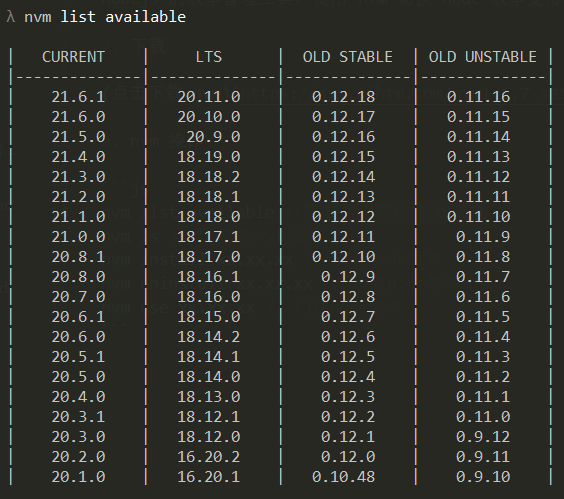

# nvm 用法

1. nvm 有什么用

nodejs 的版本管理工具，使用 nvm 切换 node 版本变得极其方便。

2. 下载

(点击下载 nvm)[https://nvm.uihtm.com/nvm1.1.7-setup.zip]

3. nvm 操作

```js
nvm list available //查看可安装NodeJS版本
nvm ls // 已安装node版本
nvm install xx.xx.xx // 安装node版本
nvm uninstall xx.xx.xx // 卸载node版本
nvm use xx.xx.xx // 切换node版本
```

4. 版本

CURRENT：当前版本、LTS：稳定版本、OLD STABLE：旧的稳定版本、OLD UNSTABLE：旧的不稳定版本


