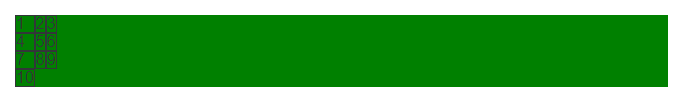
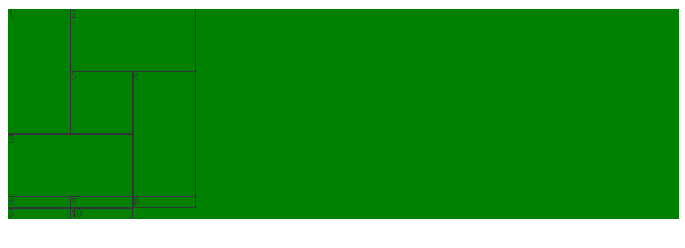

# grid 栅格布局

前言：Grid 布局是将容器划分成"行"和"列"，产生单元格，然后指定"项目所在"的单元格，可以看作是二维布局。

一 术语

1. 容器

采用网格布局的区域，也就是最外层盒子。

2. 项目

容器包裹的一级子元素，不包含二级及其以下的子元素。当容器使用了 grid 布局，项目的 float，display 等设置都将失效。

3. 单元格

通过容器设置行列属性，切割出来的单元格。单元格不等于项目，打个比方，容器相当于一个房子，单元格相当于在房子里划分出的一个个房间，项目相当于房间里的家具等东西。

二 容器属性

demo 默认样式，未设置 grid 属性。

```html
<template>
  <div class="container">
    <span v-for="i in 10" :class="`item${i}`">{{ i }}</span>
  </div>
</template>

<style lang="scss" scoped>
  .container {
    background: green;
    span {
      border: 1px solid;
    }
  }
</style>
```


1. display

设置网格布局

1.1 display: grid

项目宽度填充整行

```scss
.container {
  background: green;
  display: grid;
  span {
    border: 1px solid;
  }
}
```


1.2 display: inline-grid

项目宽度根据内容撑宽。

```scss
.container {
  background: green;
  display: inline-grid;
  span {
    border: 1px solid;
  }
}
```


2. grid-template-columns

划分容器列和列宽，可以单独或混合使用：绝对值 px，百分比 %，比例 fr，关键字 auto，函数 minmax，函数 repeat，函数 fit-content

2.1 绝对值 px

设置 3 列，每列宽 300px

```scss
.container {
  background: green;
  display: grid;
  grid-template-columns: 300px 300px 300px;
  span {
    border: 1px solid;
  }
}
```


2.2 百分比 %

设置 3 列，每列宽 33.33 %

```scss
.container {
  background: green;
  display: grid;
  grid-template-columns: 33.33% 33.33% 33.33%;
  span {
    border: 1px solid;
  }
}
```


2.3 比例 fr

总宽度除以总的 fr，得到每份 fr 所占宽度，然后分给设置的列宽，例：设置 3 列，第 2 列是第 1 列的 1 倍，第 3 列是第 1 列的 3 倍

```scss
.container {
  background: green;
  display: grid;
  grid-template-columns: 1fr 2fr 3fr;
  span {
    border: 1px solid;
  }
}
```


2.4 关键字 auto

宽度自适应，设置 3 列，第 1 列 100px，第 3 列 100px，第 2 列宽度自适应

```scss
.container {
  background: green;
  display: grid;
  grid-template-columns: 100px auto 100px;
  span {
    border: 1px solid;
  }
}
```


2.5 函数 minmax

minmax(min, max)，用于产生一个长度范围，设置 3 列，第 2 列 自适应宽度在 100px 到 300px 之间，第 1 列和第 3 列宽度为 300px。

```scss
.container {
  background: green;
  display: grid;
  grid-template-columns: 300px minmax(100px, 300px) 300px;
  span {
    border: 1px solid;
  }
}
```


2.6 函数 repeat

repeat(n, content)，n 代表重复次数，可以是数字代表几次，可以 auto-fill 自动填充满，content 代表重复内容。设置 3 列，每列 1fr。

```scss
.container {
  background: green;
  display: grid;
  grid-template-columns: repeat(3, 100px);
  span {
    border: 1px solid;
  }
}
```


设置每列 100px，每行自动填充最多的 100px 列

```scss
.container {
  background: green;
  display: grid;
  grid-template-columns: repeat(auto-fill, 100px);
  span {
    border: 1px solid;
  }
}
```


2.7 函数 fit-content

fit-content(length)，当内容小于 length，以内容为准，如果大于 length 以 leng 为长度，设置 3 列，每列最大宽度 200px，当小于 200px，以内容撑开宽度。

```scss
.container {
  background: green;
  display: grid;
  grid-template-columns: repeat(3, fit-content(200px));
  span {
    border: 1px solid;
  }
}
```



3. grid-template-rows

划分容器行和行高，属性同 grid-template-columns 一致，比例 fr 略有不同。如果不设置项目高度，1fr 代表的高度就是项目高度，如果设置有项目设置了高度，那就以该项目的高度除以该项目所分的 fr 算出 1fr 的大小。

设置列宽 200px，自动铺满列，不设置项目高度，第 1 行 2fr，第 2 行 2fr，第 3 行 3fr。

```scss
.container {
  background: green;
  display: grid;
  grid-template-columns: repeat(auto-fill, 200px);
  grid-template-rows: 1fr 2fr 3fr;
  span {
    border: 1px solid;
  }
}
```


设置列宽 200px，自动铺满列，设置项目 item5 高度 200 px，第 1 行 2fr，第 2 行 2fr，第 3 行 3fr。

```scss
.container {
  background: green;
  display: grid;
  grid-template-columns: repeat(auto-fill, 200px);
  grid-template-rows: 1fr 2fr 3fr;
  span {
    border: 1px solid;
  }
  .item5 {
    height: 200px;
  }
}
```


4. grid-template-areas

区域命名，区域命名形成区域一定要是矩形区域，无论是 L，凹，凸都是无效属性值。可以配合 grid-template-rows、grid-template-columns 使用。

设置 3 列每列 100px，3 行每行 100px，通过区域命名实现如图布局。

```scss
.container {
  background: green;
  display: grid;
  grid-template-columns: repeat(3, 100px);
  grid-template-rows: repeat(3, 100px);
  grid-template-areas:
    "left top top"
    "left middle right"
    "bottom bottom right";
  span {
    border: 1px solid;
  }
  .item1 {
    grid-area: left;
  }
  .item2 {
    grid-area: top;
  }
  .item3 {
    grid-area: middle;
  }
  .item4 {
    grid-area: right;
  }
  .item5 {
    grid-area: bottom;
  }
}
```



5. grid-template

是 grid-template-columns、grid-template-rows 这 2 个属性的合并简写形式。

```scss
grid-template-columns: repeat(3, 100px);
grid-template-rows: repeat(3, 100px);

// 简写
grid-template: repeat(3, 100px) / repeat(3, 100px);
```

6. column-gap

设置列间距，支持数值和百分比。设置列间距为 20px。

```scss
.container {
  background: green;
  display: grid;
  grid-template-columns: repeat(auto-fill, 200px);
  column-gap: 20px;
  span {
    border: 1px solid;
  }
}
```


7. row-gap

设置行间距，支持数值和百分比。设置行间距 10px。

```scss
.container {
  background: green;
  display: grid;
  grid-template-columns: repeat(auto-fill, 200px);
  row-gap: 10px;
  span {
    border: 1px solid;
  }
}
```


8. grid-gap

行间距和列间距简写，grid-gap: 行间距，列间距，如果第二个值省略，默认两个值相等。设置行间距，列间距都为 20px。

```scss
.container {
  background: green;
  display: grid;
  grid-template-columns: repeat(auto-fill, 200px);
  grid-gap: 20px;
  span {
    border: 1px solid;
  }
}
```


9. grid-auto-flow

改变布局顺序

10. justify-items

单元格内容水平位置：start、end、center、stretch

10. align-items

单元格内容垂直位置：start、end、center、stretch

11. place-items

是 align-items 属性和 justify-items 属性的合并简写形式。如果省略第二个值，则浏览器认为与第一个值相等。

12. justify-content

容器内容水平位置：start、end、center、stretch、space-around、space-between、space-evenly

12. align-content

容器垂直位置：start、end、center、stretch、space-around、space-between、space-evenly

13. place-content

是 align-content 属性和 justify-content 属性的合并简写形式。如果省略第二个值，浏览器就会假定第二个值等于第一个值。

三 项目属性

1. grid-column-start、grid-column-end

左边框、右边框所在的垂直网格线，

1. grid-row-start、grid-row-end

上边框、下边框所在的水平网格线

1.  容器属性

```scss
.container {
  width: 500px;
  height: 500px;
  /* 容器的类型为块元素grid还是行内元素inline-grid */
  display: grid;
  border: 1px solid;

  /* 设置列和列宽：auto-fill，屏幕每行容纳最多的200px的盒子 */
  grid-template-columns: repeat(auto-fill, 200px);
  /* fr：剩余空间平均后的一等分 */
  /* grid-template-columns: 200px 1fr 2fr 3fr; */
  /* minmax：最大和最小尺寸，如下 最小300px，最大2fr */
  /* grid-template-columns: 1fr 1fr minmax(300px, 2fr) */
  /* auto：宽度自适应 */
  /* grid-template-columns: 100px auto 100px; */

  /* 设置 行间距 列间距 */
  grid-gap: 10px 20px;

  /* 设置行高：设置每列高度都为200px */
  grid-auto-rows: 200px;
  /* 单独设置每列的行高 */
  /* grid-template-rows: 100px 200px; */

  /* 设置区域命名，同子项目里的grid-area使用 */
  grid-template-areas:
    ". header header"
    "sidebar content content";
  // header子项目占了两份
  .header {
    grid-area: header;
  }

  // 单元格内容水平位置
  justify-items: start | end | center | stretch;
  // 单元格内容垂直位置
  align-items: start | end | center | stretch;

  // 整个内容区域在容器里面的水平位置
  justify-content: start | end | center | stretch | space-around | space-between
    | space-evenly;
  // 整个内容区域的垂直位置
  align-content: start | end | center | stretch | space-around | space-between |
    space-evenly;
}
```

2. 项目属性

```scss
.child {
  // 可以指定网格项目所在的四个边框，分别定位在哪根网格线，从而指定项目的位置
  grid-column-start: 1;
  grid-column-end: 2;
  grid-row-start: 1;
  grid-row-end: 2;

  // 单元格内容的水平、垂直位置，同justify-items、align-items只作用于单个项目
  justify-self: start | end | center | stretch;
  align-self: start | end | center | stretch;
  place-self
}
```

## 容器属性

### 容器的类型为块元素还是行内元素

```css
.container {
  display: grid | inline-grid;
}
```

### 栅格轨道的数量以及宽度

```css
/* auto：默认情况下该栅格轨道会充满栅格容器的富余空间 */
.container {
  display: grid;
  grid-template-columns: 100px auto 100px;
  grid-template-rows: repeat(2, 50px);
  grid-gap: 10px;
}
```

### 给栅格单元命名，同名的栅格单元自动成为一个栅格区域。

```css
.container {
  display: grid;
  grid-template-columns: repeat(3, 1fr);
  grid-template-areas:
    "header header header"
    "sidebar main main"
    "footer footer footer";
}
```

命名之后有什么用呢？栅格项目有一个 grid-area 属性，它来瓜分栅格区域。

```css
.item {
  grid-area: header;
}
```

这个意思是说，名字叫 header 的栅格区域都是我的，撒尿为证。

缺省名字：不知道叫什么的时候就用.代替。

```css
.container {
  display: grid;
  grid-template-columns: repeat(3, 1fr);
  grid-template-areas:
    "main main sidebar"
    "main main .";
}
```

### 长度的取值种类

1. fr：富余空间为总长度，以声明的 fr 数量总和为分母，以自身声明的 fr 数量为分子

```css
.container {
  display: grid;
  grid-template-columns: 100px repeat(2, 1fr);
  grid-template-rows: repeat(2, 50px);
  grid-gap: 10px;
}
```

2. minmax()：它有两个参数，分别是最小值和最大值。当栅格单元需要压缩时，最小值就是栅格项目被压缩的最小极限，当栅格单元有剩余空间时，最大值就是栅格项目扩张的最大极限。

```css
.container {
  display: grid;
  grid-template-columns: minmax(100px, 200px) 300px 300px;
}
```

3. fit-content()：当内容小于 200px 时，以内容为长度，当内容大于 200px 时，以 200px 为长度。

```css
.container {
  display: grid;
  grid-template-columns: repeat(3, fit-content(200px));
  grid-template-rows: repeat(2, 50px);
  grid-gap: 10px;
}
```

4. repeat()第一个参数取值 auto-fill 和 auto-fit

auto-fill 和 auto-fit 的共同点在于它们会保证栅格系统不溢出栅格容器。因为如果你写死了重复多少个，栅格容器空间不够的话只能溢出了。

而不同点在于，auto-fill 会生成尽可能多的栅格轨道，即便这些轨道看起来没什么用；auto-fit 则会生成尽可能少的栅格轨道，以便让那些自适应的栅格单元尽可能占用更多空间。

所以区别在于，auto-fill 想让栅格轨道尽可能多，auto-fit 想让栅格单元尽可能大。

```css
.container {
  display: grid;
  grid-template-columns: repeat(auto-fit, minmax(300px, 1fr));
}
```

这里的意思是说，自适应布局，每个栅格项目长度等分，但最小不低于 300px。最大不超过 600px，因为超过 600px 就是两个 300px。

### 栅格单元之间的空隙

```css
.container {
  grid-column-gap: <length>;
  grid-row-gap: <length>;
  grid-gap: <length>;
}
```

### 项目相对于区域的对齐方式

```css
.container {
  /* 水平对齐方式 */
  justify-items: stretch /*default*/ | start | end | center;

  /* 垂直对齐方式 */
  align-items: stretch /*default*/ | start | end | center;
}
```

### 栅格系统相对于栅格容器的水平对齐方式。

```css
.container {
  /* 水平对齐方式 */
  justify-content: start /*default*/ | end | center | stretch | space-around |
    space-between | space-evenly;

  /* 垂直对齐方式 */
  align-content: start /*default*/ | end | center | stretch | space-around |
    space-between | space-evenly;
}
```

### 编外栅格单元的高度和宽度。

```css
.container {
  grid-auto-columns: <length> <length> <length>;
  grid-auto-rows: <length> <length> <length>;
}
```

### 栅格项目应该如何依次排列

```css
.container {
  /* row：水平排  column：垂直排 */
  grid-auto-flow: row /*default*/ | column | dense | row dense | column dense;
}
```

## 项目属性

### 栅格项目占据哪个栅格区域。

```css
item {
  grid-area: <name> | <row-start> / <column-start> / <row-end> / <column-end>;
}
```

### 这是两个集合属性，它们可以同时声明在某个方向开始和结束的位置。

```css
.item {
  grid-column: <start> / <end>;
  grid-row: <start> / <end>;
}
```

### 栅格项目相对于栅格区域对齐方式, 覆盖栅格容器

```css
.item {
  /* 水平对齐方式 */
  justify-self: stretch /*default*/ | start | end | center;

  /* 垂直对齐方式 */
  align-self: stretch /*default*/ | start | end | center;
}
```
