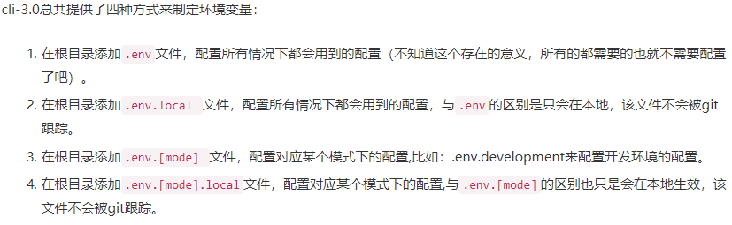
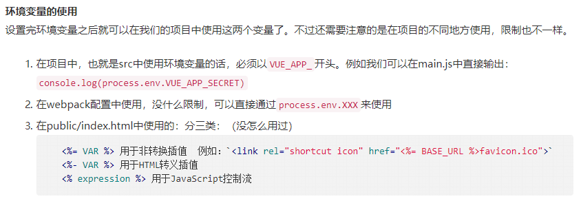

<h1 align="center">VUE笔记</h1>

## 计算属性 set

```
compouted: {
  // 一般情况只有get
  name() {
    return this.firstname + this.lastname;
  }

  // 也可以有set
  name: {
    get() {
      return this.firstname + this.lastname;
    },
    set(val) {
      this.firstname = val.split(1,2);
      this.lastname = val.split(2,3);
    }
  }
}
```

## class 和 style 得绑定

```
// isActive 为变量
<div :class="{ active: isActive }"></div>

// 数组内为变量
<div :class="[activeClass, errorClass]"></div>

// 可以用3元表达式
<div :class="[isActive ? activeClass : '', errorClass]"></div>
```

## 生命周期


## 方法修饰符

1.

## vue 插槽

**普通插槽：**

```
<!-- 引用组件 -->
<navigation-link url="/profile">
  Your Profile
</navigation-link>

<!-- 组件 -->
<a
  v-bind:href="url"
  class="nav-link"
>
  <slot></slot>
</a>
```

**具名插槽：**

```
<!-- 子组件 -->
<div class="container">
  <header>
    <slot name="header"></slot>
  </header>
  <main>
    <slot></slot>
  </main>
  <footer>
    <slot name="footer"></slot>
  </footer>
</div>

<!-- 父组件 -->
<base-layout>
  <template slot="header">
    <h1>Here might be a page title</h1>
  </template>

  <p>A paragraph for the main content.</p>
  <p>And another one.</p>

  <template slot="footer">
    <p>Here's some contact info</p>
  </template>
</base-layout>
```

**作用域插槽：**

```
<!-- 子组件 -->
<slot v-bind="scope" />

<!-- 父组件 -->
<template slot-scope="{ row }">
  {{ row.name }}
</template>

<!-- 父组件拿到子组件的数据 -->
```

## v-for 中 key 的作用，是否必须

> 当 Vue.js 用 v-for 正在更新已渲染过的元素列表时，它默认用“就地复用”策略。如果数据项的顺序被改变，Vue 将不会移动 DOM 元素来匹配数据项的顺序， 而是简单复用此处每个元素，并且确保它在特定索引下显示已被渲染过的每个元素。这个类似 Vue 1.x 的 track-by="\$index" 。

<h2 align="center">VUEX</h2>

## state、mutations、actions

```
// state
this.$store.state.common.name;
// mutations
this.$store.commit("common/name");
// actions
this.$store.dispatch("common/name");
```

## mapState，mapMutations

> 当一个组件需要获取多个状态时候，将这些状态都声明为计算属性会有些重复和冗余。为了解决这个问题，我们可以使用 mapState 辅助函数帮助我们生成计算属性，让你少按几次键

```
computed: {
  ...mapState("common", ["asideTop", "asideFold", "controlOpen"])
},
methods: {
  ...mapMutations("common", ["updateAsideFold", "updateControlOpen"])
}
```

## v-cloak 的作用和用法

> HTML 绑定 Vue 实例，在页面加载时会闪烁,v-cloak 可以解决这一问题，在 css 中加上

```
[v-cloak] {
  display: none;
}
```

> 在 html 中的加载点加上 v-cloak，就可以解决这一问题

```
<div id="app" v-cloak>
    {{msg}}
</div>
```

## vue.config.js 配置

### 1. publicPath: { type: String, default: '/' }

> 默认情况被部署根路径上，如果被部署在一个子路径上，你就需要用这个选项指定这个子路径。例如，则设置 publicPath 为 /子路径/

> 这个值也可以为空字符串 ('') 或('./')，这样打出来的包可以被部署在任意路径。

### 2. outputDir: { type: Stirng, default: 'dist' }

> 当运行 vue-cli-service build 时生成的生产环境构建文件的目录。注意目标目录在构建之前会被清除 (构建时传入 --no-clean 可关闭该行为)。

### 3. assetsDir: { type: String, default: '' }

> 放置生成的静态资源 (js、css、img、fonts) 的 (相对于 outputDir 的) 目录。

### 4. indexPath: { type: String, default: 'index.html' }

> 指定生成的 index.html 的输出路径 (相对于 outputDir)。也可以是一个绝对路径。

### 5. filenameHashing: { type: Boolean, default: true }

> 默认情况下，生成的静态资源在它们的文件名中包含了 hash 以便更好的控制缓存。然而，这也要求 index 的 HTML 是被 Vue CLI 自动生成的。如果你无法使用 Vue CLI 生成的 index HTML，你可以通过将这个选项设为 false 来关闭文件名哈希。

### 6. pages: { type: Object, default: undefined }

> 在 multi-page 模式下构建应用。每个“page”应该有一个对应的 JavaScript 入口文件。其值应该是一个对象，对象的 key 是入口的名字，value 是：1. 一个指定了 entry, template, filename, title 和 chunks 的对象 (除了 entry 之外都是可选的)；2. 或一个指定其 entry 的字符串。

```
module.exports = {
  pages: {
    index: {
      // page 的入口
      entry: 'src/index/main.js',
      // 模板来源
      template: 'public/index.html',
      // 在 dist/index.html 的输出
      filename: 'index.html',
      // 当使用 title 选项时，
      // template 中的 title 标签需要是 <title><%= htmlWebpackPlugin.options.title %></title>
      title: 'Index Page',
      // 在这个页面中包含的块，默认情况下会包含
      // 提取出来的通用 chunk 和 vendor chunk。
      chunks: ['chunk-vendors', 'chunk-common', 'index']
    },
    // 当使用只有入口的字符串格式时，
    // 模板会被推导为 `public/subpage.html`
    // 并且如果找不到的话，就回退到 `public/index.html`。
    // 输出文件名会被推导为 `subpage.html`。
    subpage: 'src/subpage/main.js'
  }
}
```

### 7. lintOnSave: { type: Boolean | 'error', default: true }

> 是否在开发环境下通过 eslint-loader 在每次保存时 lint 代码。这个值会在 @vue/cli-plugin-eslint 被安装之后生效

> 设置为 true 时，eslint-loader 会将 lint 错误输出为编译警告。默认情况下，警告仅仅会被输出到命令行，且不会使得编译失败。

> 如果你希望让 lint 错误在开发时直接显示在浏览器中，你可以使用 lintOnSave: 'error'。这会强制 eslint-loader 将 lint 错误输出为编译错误，同时也意味着 lint 错误将会导致编译失败。

> 当 lintOnSave 是一个 truthy 的值时，eslint-loader 在开发和生产构建下都会被启用。如果你想要在生产构建时禁用 eslint-loader，你可以用如下配置：

```
// vue.config.js
module.exports = {
  lintOnSave: process.env.NODE_ENV !== 'production'
}
```

### 8. runtimeCompiler: { type: Boolean, default: false }

> 是否使用包含运行时编译器的 Vue 构建版本。设置为 true 后你就可以在 Vue 组件中使用 template 选项了，但是这会让你的应用额外增加 10kb 左右。

### 9. transpileDependencies: { type: Array<string | RegExp>, defalut: [] }

> 默认情况下 babel-loader 会忽略所有 node_modules 中的文件。如果你想要通过 Babel 显式转译一个依赖，可以在这个选项中列出来

### 10. productionSourceMap: { type: Boolean, default: true }

> 如果你不需要生产环境的 source map，可以将其设置为 false 以加速生产环境构建.

### 11. crossorigin: { type: String, default: undefiend }

> 设置生成的 HTML 中 \<link rel="stylesheet"> 和 \<script> 标签的 crossorigin 属性。

> 需要注意的是该选项仅影响由 html-webpack-plugin 在构建时注入的标签 - 直接写在模版 (public/index.html) 中的标签不受影响。

### 12. integrity: { type: Boolean, default: false }

> 在生成的 HTML 中的 \<link rel="stylesheet"> 和 \<script> 标签上启用 Subresource Integrity (SRI)。如果你构建后的文件是部署在 CDN 上的，启用该选项可以提供额外的安全性。

> 需要注意的是该选项仅影响由 html-webpack-plugin 在构建时注入的标签 - 直接写在模版 (public/index.html) 中的标签不受影响。

> 另外，当启用 SRI 时，preload resource hints 会被禁用，因为 Chrome 的一个 bug 会导致文件被下载两次。

### 13. configureWebpack: { type: Object | Function }

> 如果这个值是一个对象，则会通过 webpack-merge 合并到最终的配置中。

> 如果这个值是一个函数，则会接收被解析的配置作为参数。该函数及可以修改配置并不返回任何东西，也可以返回一个被克隆或合并过的配置版本。

### 14. chainWebpack: { type: Function }

> 是一个函数，会接收一个基于 webpack-chain 的 ChainableConfig 实例。允许对内部的 webpack 配置进行更细粒度的修改。

### 15. css.modules: { type: Boolean, default: false }

> 默认情况下，只有 _.module.[ext] 结尾的文件才会被视作 CSS Modules 模块。设置为 true 后你就可以去掉文件名中的 .module 并将所有的 _.(css|scss|sass|less|styl(us)?) 文件视为 CSS Modules 模块。

### 16. css.extract: { type: Boolean | Object, default: 生产环境下是 true，开发环境下是 false }

> 是否将组件中的 CSS 提取至一个独立的 CSS 文件中 (而不是动态注入到 JavaScript 中的 inline 代码)。

> 同样当构建 Web Components 组件时它总是会被禁用 (样式是 inline 的并注入到了 shadowRoot 中)。

> 当作为一个库构建时，你也可以将其设置为 false 免得用户自己导入 CSS。

> 提取 CSS 在开发环境模式下是默认不开启的，因为它和 CSS 热重载不兼容。然而，你仍然可以将这个值显性地设置为 true 在所有情况下都强制提取。

### 17. css.sourceMap: { type: Boolean, default: false }

> 是否为 CSS 开启 source map。设置为 true 之后可能会影响构建的性能.

### 18. css.loaderOptions: { type: Object, default: {} }

> 向 CSS 相关的 loader 传递选项。例如：

```
module.exports = {
  css: {
    loaderOptions: {
      css: {
        // 这里的选项会传递给 css-loader
      },
      postcss: {
        // 这里的选项会传递给 postcss-loader
      }
    }
  }
}
```

### 19. devServer: { type: Object }

> 有些值像 host、port 和 https 可能会被命令行参数覆写。

> 有些值像 publicPath 和 historyApiFallback 不应该被修改，因为它们需要和开发服务器的 publicPath 同步以保障正常的工作。

### 20. devServer.proxy: { type: String | Object }

> 如果你的前端应用和后端 API 服务器没有运行在同一个主机上，你需要在开发环境下将 API 请求代理到 API 服务器。这个问题可以通过 vue.config.js 中的 devServer.proxy 选项来配置。

> devServer.proxy 可以是一个指向开发环境 API 服务器的字符串：

```
module.exports = {
  devServer: {
    proxy: 'http://localhost:4000'
  }
}
```

> 这会告诉开发服务器将任何未知请求 (没有匹配到静态文件的请求) 代理到http://localhost:4000

> 如果你想要更多的代理控制行为，也可以使用一个 path: options 成对的对象。

```
module.exports = {
  devServer: {
    proxy: {
      '/api': {
        target: '<url>',
        ws: true,
        changeOrigin: true
      },
      '/foo': {
        target: '<other_url>'
      }
    }
  }
}
```

### 21. parallel: { type: Boolean, default: require('os').cpus().length > 1 }

> 是否为 Babel 或 TypeScript 使用 thread-loader。该选项在系统的 CPU 有多于一个内核时自动启用，仅作用于生产构建

### 22. pwa: { type: Object }

> 向 PWA 插件传递选项

### 23. pluginOptions: { type: Object }

> 这是一个不进行任何 schema 验证的对象，因此它可以用来传递任何第三方插件选项。例如：

```
module.exports = {
  pluginOptions: {
    foo: {
      // 插件可以作为 `options.pluginOptions.foo` 访问这些选项。
    }
  }
}
```

## Babel

> Babel 可以通过 babel.config.js 进行配置

> Vue CLI 使用了 Babel 7 中的新配置格式 babel.config.js。和 .babelrc 或 package.json 中的 babel 字段不同，这个配置文件不会使用基于文件位置的方案，而是会一致地运用到项目根目录以下的所有文件，包括 node_modules 内部的依赖。我们推荐在 Vue CLI 项目中始终使用 babel.config.js 取代其它格式。

> 所有的 Vue CLI 应用都使用 @vue/babel-preset-app，它包含了 babel-preset-env、JSX 支持以及为最小化包体积优化过的配置。通过它的文档可以查阅到更多细节和 preset 选项。

## ESLint

> ESLint 可以通过 .eslintrc 或 package.json 中的 eslintConfig 字段来配置。

## .env vue-cli3.0 环境变量与模式




1. .env.development 和.env 区别

当我们跑 yarn serve 时，优先采用.env.development
环境变量，当不存在时，采用.env 变量。

当我们跑 yarn bulit 时，采用.env 变量

## Router

```
import Vue from "vue";
import Router from "vue-router";

Vue.use(Router);

const router = new Router({
  mode: "hash",
  base: process.env.VUE_APP_BASEURL,
  scrollBehavior: () => ({ y: 0 }),

  routes: [
    {
      path: '/foo',
      name: 'foo',
      redirect: { name: 'login' },
      component: () => import("@/views/foo"),
      meta: {
        title: 'foo'
      },
      children: [
        {
          path: '/foo/edit',
          name: 'edit',
          component: () => import("@/views/foo/eidt"),
          meta: {
            title: 'edit'
          }
        }
      ],
      beforeEnter(to, from, next) {
        const TK = Vue.cookie.get("token");
        TK && next({ name: 'home' }) : next();
      }
    }
  ]
})

router.beforeEach((to, from, next) => {
  const token = Vue.cookie.get("token");
  const hasToken = token && /\S/.test(token);

  if (!hasToken) {
    // - 是全局路由, 直接访问
    // - 否则, 重定向至 { name: 'login' }
    return isGlobalRoute(to) ? next() : next({ name: "login" });
  }else {
    next();
  }
})

export default router;
```

### props

1. 数组,对象 props 默认值回调函数

```
props: {
  A: {
    type: Array,
    default: function() {
      return ...
    }
  }
}
```

2. props 多种类型数组表示

```
props: {
  A: {
    type: [Stirng, Number]
  }
}
```
