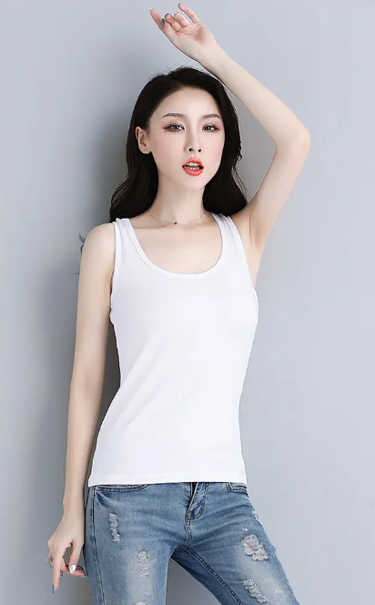

# 模特换装效果

前言：通过使用 mask 蒙版，mix-blend-mode 混合模式，实现模特换装效果。

1. 准备工作

首先需要准备两张图片，一张是全身图，需要换装的部分要求要是白色，为什么要是白色呢，因为在使用 mix-blend-mode 混合模式时，需要将上层颜色和下层颜色混合，如果下层颜色是白色，那么混合后的颜色，就是上层的颜色。第二张图片是要换装的部分，宽高大小需要和第一张图片一致，方便后续定位到全身图的相对位置。其他地方透明。换装的地方不透明，随便什么颜色。方便使用 mask 蒙版更换颜色。

<!-- demo -->
<!-- yf -->

2. 例子

使用 mask 蒙版， mix-blend-mode 混合模式，实现换装

```html
<!DOCTYPE html>
<html lang="en">
  <head>
    <meta charset="UTF-8" />
    <meta name="viewport" content="width=device-width, initial-scale=1.0" />
    <title>Document</title>
    <style>
      .card {
        width: 300px;
        height: 500px;
        position: relative;
        margin: 200px auto;
        background: blue;
      }
      .source {
        display: block;
        width: 100%;
        height: 100%;
        object-fit: cover;
      }
      .skirt {
        position: absolute;
        inset: 0;
        background: #f40;
        --mask: url("../../images/每日博客/模特换装效果/yf.png") 50% 50% / cover;
        mask: var(--mask);
        -webkit-mask: var(--mask);
        mix-blend-mode: multiply;
      }
    </style>
  </head>
  <body>
    <div class="card">
      
      <div class="skirt"></div>
    </div>
  </body>
</html>
```

<!-- 2 -->
